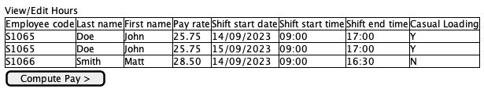
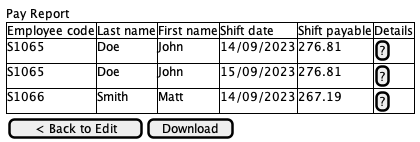
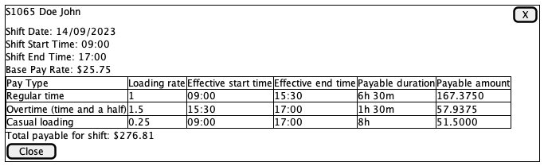

# Solution Design

- [App Architecture](#app-architecture)
- [Data Models](#data-models)
- [Data Processing](#data-processing)
- [User Interface](#user-interface)

## App Architecture

Application is a single-page application written using React. All logic is contained in the SPA; there are no backend
components or network calls made by the SPA.

The SPA is served statically via CloudFront, backed by an S3 origin.

## Data Models

Key input entities:

- Worker
- Shift
- Schedule (defined in code/configuration, not user input)
- AwardRules

Key output entities:

- ClassifiedPayableTime
- ShiftPayable
- WorkerPayable

See [models](./award-calculator-fe/src/models) for specific attributes & relationships

## Data processing

**TODO**

## User Interface

### Data Entry & Modification Screen

All shift data will be displayed in an editable table, with 1 shift per row. An optional file upload may be provided,
which will populate the UI table with data from the file.

If there is already data in the UI table when a file is provided, the existing data will be dropped & overwritten by
the new file.

Employees in the table are uniquely identified by the `Employee code` field.

Once all data has been entered, the user may click "Compute Pay" to move to the screen that shows the outcome of the
pay calculation.

#### Validation

Validation will be provided in the following ways:

1. In real-time whenever the UI table is updated
2. When a file is selected for upload

If the file data fails any validation, the UI table will be populated anyway and all failues shown in the same way as
for manually entered data.

Validation rules may apply at 1 of 2 levels. Field-level validation ensures a particular data value has a correct
format & value. Table-level validation ensures data consistency between rows of the table.

**Field-level validation**

- `Employee code` must match pattern `[a-zA-Z0-9]+`
- `Last name` and `First name` must each contain at least 1 character
- `Pay rate` must match pattern `\$?[0-9]+(\.[0-9]{1,2})?`
- `Pay rate` must have a value of `0.01` or greater
- `Shift start date` must be in the format of `dd/mm/yy` or `dd/mm/yyyy`
- `Shift start time` and `Shift end time` must each be in the format of `HH:MM`
- `Shift end time` must be at least 1 minute after `Shift start time`
- `Casual loading` must have one of the following values (case insensitive):
  - `y`
  - `n`
  - `yes`
  - `no`
  - `true`
  - `false`

**Table-level validation**

- For any 2 rows with the same `Employee code`, the following fields must also be the same:
  - `Last name`
  - `First name`
  - `Pay rate`
  - `Casual loading`

### Pay report screen

The rows in the pay report screen will correspond 1-to-1 with the rows in the input screen, with the same ordering.

The "Download" button will trigger a CSV download of this pay report.

Each row in the result table includes a "details" button which when clicked, opens a modal with a detailed breakdown of
the components of pay for that shift.

